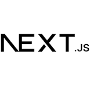

# 🏪 ShopManager - Multi-Tenant POS & Business Management System

A production-grade, full-stack Point of Sale (POS) and business management system built for the Lingo.dev hackathon. Built with Next.js 14, TypeScript, Supabase, and shadcn/ui.

[](https://youtu.be/0hHslCvAye8)

<p align="center">
  
  &nbsp;&nbsp;&nbsp;
  
  &nbsp;&nbsp;&nbsp;
  
</p>


## Features

- Multi-tenant architecture (per-shop isolation)
- Role-based access (Admin, Cashier, Inventory Manager)
- POS system with cart and checkout
- Inventory management with stock tracking
- Sales history with invoice generation (PDF)
- Revenue analytics and charts
- Low-stock alerts
- Internationalization (English ↔ Hindi via Lingo.dev)
- Secure authentication using Supabase + RLS
- Fully responsive UI

---

## Tech Stack

| Layer | Technology |
|------|------------|
| Framework | Next.js (App Router) |
| Language | TypeScript |
| Backend | Supabase (Postgres + Auth + RLS) |
| State | Zustand |
| Styling | Tailwind CSS |
| UI | shadcn/ui + Radix |
| Validation | Zod + React Hook Form |
| Charts | Recharts |
| i18n | Lingo.dev |
| PDF | jsPDF |

---

## Architecture Overview

```

Next.js (App Router)
├── Server Actions (Auth, Products, Sales, Analytics, Settings)
├── Supabase (Postgres + RLS + Auth)
├── Zustand (Shop + Cart state)
├── Multi-tenant via shop_id
└── Lingo.dev i18n layer

````

---

## Core Modules

### Authentication & Multi-Tenancy
- Shop owner signup creates shop automatically
- Role-based access
- Secure middleware route protection

### POS
- Fast checkout flow
- Zustand-powered cart
- Invoice and receipt generation

### Inventory
- Product CRUD
- Category management
- Stock adjustments with audit logs
- Low-stock alerts

### Sales
- Full transaction history
- Sequential invoice numbers via database
- CSV export and PDF receipts

### Analytics
- Revenue charts
- Top-selling products
- Daily / monthly statistics

---

## Database (Supabase)

- Multi-tenant using `shop_id`
- Row Level Security enabled
- Inventory triggers prevent negative stock
- Sequential invoice numbering (`INV-YYYYMM-XXXX`)
- Full audit trail for stock changes

---

## Internationalization (Lingo.dev)

- Automatic translation (English → Hindi)
- Runtime language switching
- Cached translation files
- Compiler-driven extraction

---

## Getting Started

### Clone Repository

```bash
git clone <your-repo-url>
cd shopmanager
````

### Install Dependencies

```bash
npm install
```

### Setup Environment Variables

Create `.env.local`

```
NEXT_PUBLIC_SUPABASE_URL=your_url
NEXT_PUBLIC_SUPABASE_ANON_KEY=your_key
SUPABASE_SERVICE_ROLE_KEY=your_service_role_key
```

### Run Development Server

```bash
npm run dev
```

---

## Hackathon Notes

* Built from scratch during Lingo.dev Hackathon
* Uses Lingo.dev for real-world i18n implementation
* Clean commit history
* Production-grade multi-tenant architecture
* Secure Supabase RLS design

---

## Demo

Add your demo video link here:

```
[Demo Video](your_video_link)
```

---

## Future Improvements

* Multi-shop switching
* Offline POS mode
* GST / tax automation
* Barcode scanning
* Mobile PWA support
* Email / WhatsApp invoice sending
* Advanced analytics dashboard

---

## Author

Ankur Singh